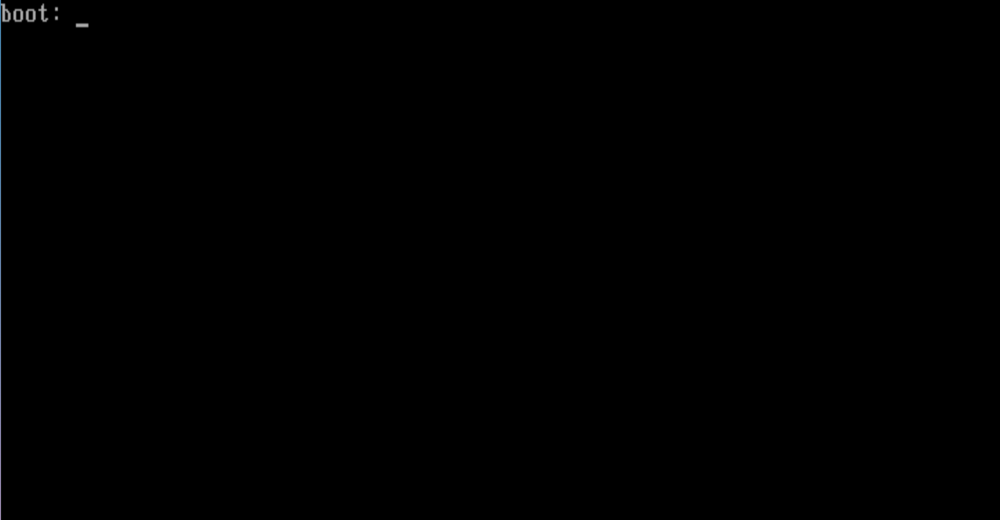
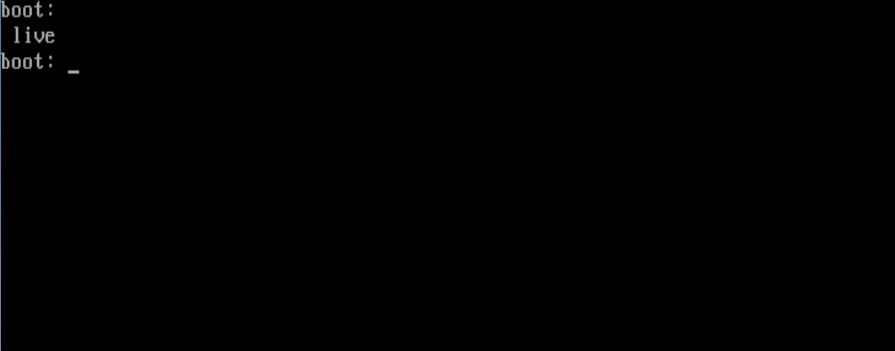
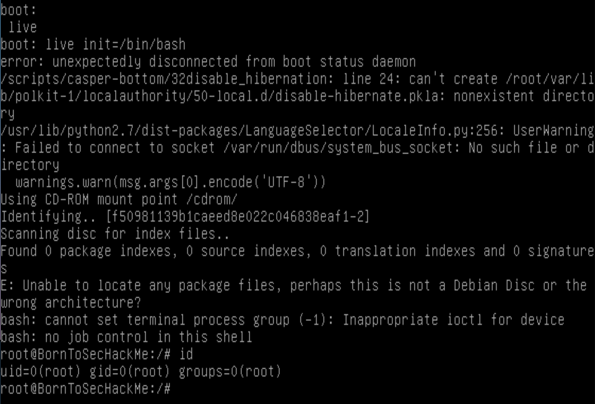

# Boot2root Writeup 1

### Interupting the booting.
You can interupt the boot. Before thinking about this. We thought about grub.Too bad they didn't include grub menu boot loader. But we can use shift to access to the cli of grub.

Now let's check what partition we have. By pressing `tab`, we see that live partition.

Then we specifiy the `/bin/bash/` or `/bin/sh`.

A simple `whoami` or `id` will show us that we are root.

