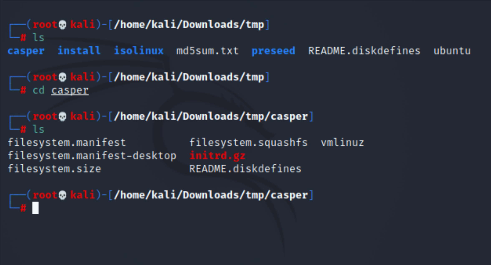

# Boot2Root Writeup 3

## Working with ISO files.
After some googling we can understand that we can work with ISO files.
You can extract the whole system into your machine.

For that I booted up a Kali Linux virtual machine, and used the following command to mount our iso file.
```
sudo mount -o loop iso_file_name.iso tmp
```


At this point I got stuck again, and really I had no background about files like this and I have never extracted an iso file before.
But luckily we have google. After searching about the files we mounted. I find out that there's a file named `filesystem.squashfs`, and if you extract it you will have the actual files in the system.



Using the following command I was able to extract everything in the casper directory.
```
sudo unsquashfs -f -d /home/kali/Desktop/tmp /home/kali/Downloads/tmp/file.squashfs
```


Let's see what we got on that `~/Desktop/tmp` directory.


Now we have all the actual files that are in the system.
We can enumerate as we want. See files like `/etc/shadow` etc...

If we look at the root home directory and look for something in `.bash_history`. We will find the password for zaz user.
And now we can continue our explotation with the `writeup4.md` to get root.


You can see now after viming into `.bash_history` we have zaz's password
```
adduser zaz
646da671ca01bb5d84dbb5fb2238dc8e
```


